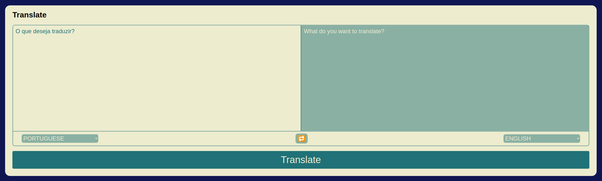

# README: Translate



## Project description

A text translation tool between several languages, using Python with the Flask Framework, to create a Server Side application. In other words, the Back-end (via the controller) will directly provide the View layer to the user.

### Technologies

-   Python
-   Flask
-   Pytest
-   MongoDB
-   Docker

### What I learned

-   Implement an API using MVC layered architecture;
-   Use Docker for Python projects;
-   Apply knowledge of Object Orientation in WEB development.
-   Write tests for APIs to ensure endpoint implementation;
-   Interact with a non-relational MongoDB database;
-   Develop Server Side web pages.

## How to run the project

1. Clone the repository:

    ```bash
    git clone https://github.com/feduarte-dev/translater
    ```

2. Navigate to the project directory:

    ```bash
    cd your-repository
    ```

3. Create virtual enviroment:
    ```bash
    python3 -m venv .venv && source .venv/bin/activate
    ```
4. Install dependencies inside container:

    ```bash
    python3 -m pip install -r dev-requirements.txt
    ```

5. Initiate the containers:

    ```bash
     docker compose up translate
    ```

6. Seed the database:

    ```bash
     docker compose exec -it translate python3 src/run_seeds.py
    ```

7. Access the URL:

    ```bash
    http://127.0.0.1:8000/
    ```

8. If you want to run tests:

    ```bash
     python3 -m pytest
    ```
